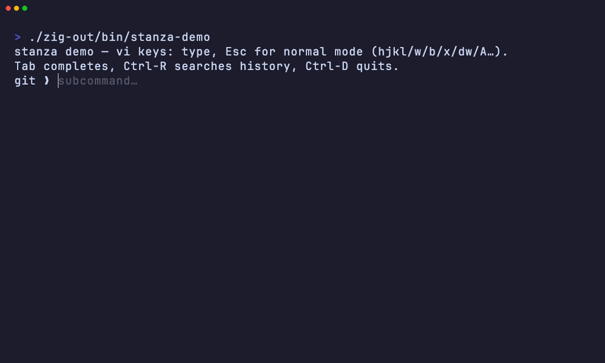

# Stanza

Stanza is a dependency-free line editor for Zig terminal programs. It provides
a readline/linenoise-style prompt with history, completion, hints,
highlighting, and vi or Emacs-style editing, without linking libc or a C
readline library.

The editor is allocator-explicit and instance-based. It talks to POSIX
terminals directly, uses raw mode and bracketed paste, detects terminal width
with a cursor-position query, and falls back to a plain line read when input or
output is not a terminal.

The current scope is POSIX terminals on macOS, Linux, and BSD. Unicode handling
is codepoint- and display-width-based, not full grapheme-cluster editing.



*The demo shows completion, ghost-text hints, command highlighting, vi-mode
editing, reverse history search, and multi-line wrapping. Recorded with
[`assets/demo.tape`](assets/demo.tape).*

## What It Includes

- **Modal vi editing (default)** — start in insert, `Esc` to normal: `h j k l
  0 $ ^ w b e` motions, `i a I A s` inserts, `x D C r ~` edits, `d`/`c`
  operators (`dw`, `cc`, `d$`), counts (`3w`), and a cursor that turns into a
  block in normal mode. Set `.editing = .emacs` for modeless readline keys.
- **Emacs editing too** — Ctrl-A/E, Ctrl-B/F, Alt-B/F by word, Ctrl-W/U/K kill,
  Ctrl-Y yank, Ctrl-T transpose, arrows, Home/End, Delete (always available in
  insert mode; the full keymap when `.editing = .emacs`).
- **History** — de-duplicated, size-bounded, persists to a file, navigable with
  Up/Down and searchable with **Ctrl-R** (reverse incremental search).
- **Completion** — a `Tab` callback; Stanza inserts the longest common prefix or
  lists candidates.
- **Hints** — dim ghost text after the cursor (e.g. suggest the rest of a word).
- **Syntax highlighting** — a paint callback styles the line as you type.
- **UTF-8 + display widths** — cursor motion, deletion, and rendering are
  codepoint- and cell-width-aware. See Limitations for the Unicode scope.
- **Bracketed paste** — multi-line pastes are inserted as text, not executed.
- **Password mode** — render a mask character instead of input.
- **Single-line or wrapped** — a long line scrolls one row by default, or set
  `.multiline = true` to wrap it across rows.
- **Resize aware** — hosts can notify the editor after a terminal resize; a
  simple opt-in SIGWINCH handler is available.
- **Graceful fallback** — when stdin/stdout is not a terminal, it does a plain
  line read so pipelines keep working.
- **Blocking or event-loop driven** — call `prompt`, or drive it from your own
  event loop with `editStart` / `editFeed` / `editStop`.
- **Bounded terminal probes** — width detection uses a poll timeout.

## Quick start

```zig
const std = @import("std");
const stanza = @import("stanza");

pub fn main() !void {
    var gpa: std.heap.DebugAllocator(.{}) = .init;
    defer _ = gpa.deinit();
    const alloc = gpa.allocator();

    var ed = stanza.Editor.init(alloc, .{});
    defer ed.deinit();
    ed.history.load(".myapp_history") catch {};

    while (true) {
        const line = ed.prompt("app ❯ ") catch |err| switch (err) {
            error.Eof => break,            // Ctrl-D on an empty line
            error.Interrupted => continue, // Ctrl-C
            else => return err,
        };
        defer alloc.free(line);
        if (line.len == 0) continue;
        try ed.history.add(line);
        // ... do something with line ...
    }
    ed.history.save(".myapp_history") catch {};
}
```

`prompt` returns a slice **owned by the caller** (free it), or `error.Eof` /
`error.Interrupted`.

## Key bindings

Stanza defaults to **vi** keys and starts in **insert mode**; press `Esc` for
normal mode (the cursor becomes a block). Tab/Ctrl-R/history work in both modes.

**Normal mode (vi)**

| Key | Action | Key | Action |
|-----|--------|-----|--------|
| `h` `l` (`Space`) | move by char | `0` `^` / `$` | line start / end |
| `w` `b` `e` | move by word | `3w` etc. | counts repeat motions |
| `i` `a` | insert before / after | `I` `A` | insert at start / end |
| `x` | delete char | `s` | substitute char |
| `D` / `C` | delete / change to end | `r` | replace one char |
| `dw` `d$` `dd` | delete word / to-end / line | `cw` `cc` | change (then insert) |
| `p` | paste last kill | `~` | toggle case |

**Insert mode & emacs (`.editing = .emacs`)**

| Key | Action | Key | Action |
|-----|--------|-----|--------|
| ←/→ Ctrl-B/F | move by char | Ctrl-A / Ctrl-E | start / end of line |
| Alt-B / Alt-F | move by word | Ctrl-←/→ | move by word |
| Backspace / Ctrl-H | delete left | Ctrl-D / Delete | delete right |
| Ctrl-W / Alt-Backspace | kill word left | Alt-D | kill word right |
| Ctrl-U | kill to start | Ctrl-K | kill to end |
| Ctrl-Y | yank (paste kill) | Ctrl-T | transpose chars |
| ↑/↓ Ctrl-P/N | history prev / next | Ctrl-R | reverse search |
| Tab | complete | Ctrl-L | clear screen |
| Enter | submit | Ctrl-C / Ctrl-D (empty) | cancel / EOF |

## Configuration

Everything beyond plain editing is opt-in through `Config` callbacks. Callbacks
use function pointers plus an opaque `ctx`, which keeps `Editor` as one concrete
runtime-configurable type.

```zig
fn complete(_: ?*anyopaque, word: []const u8, out: *stanza.Completions) anyerror!void {
    for (subcommands) |c| if (std.mem.startsWith(u8, c, word)) try out.add(c);
}

fn hint(_: ?*anyopaque, line: []const u8) ?stanza.Hint {
    return if (line.len == 0) .{ .text = "type a command…" } else null;
}

fn paint(_: ?*anyopaque, line: []const u8, out: *stanza.Painter) anyerror!void {
    try out.put(line, .{ .color = .green, .bold = true });
}

var ed = stanza.Editor.init(alloc, .{
    .complete = complete,
    .hint = hint,
    .paint = paint,
    // .editing = .emacs,    // modeless readline keys (default is .vi)
    // .mask = '*',          // password mode
    // .install_resize_handler = true, // opt-in process-wide SIGWINCH handler
    // .ctx = &my_state,     // handed back to every callback
    // .max_history = 5000,
});
```

The highlighter must keep the visible characters identical to the input and add
only zero-width SGR escapes; it applies when the whole line fits on screen.

## Event Loop API

`prompt` blocks. To drive Stanza from your own `poll`/`select` loop instead,
use `editStart` / `editFeed` / `editStop`: start editing, call `editFeed` each
time `fd()` is readable, and it returns `.more` until Enter yields a `.line`.
`editFeed` processes bytes already available on the descriptor and returns
without waiting for the rest of a partial UTF-8 sequence, escape sequence,
bracketed paste, or reverse-search query.

```zig
var ed = stanza.Editor.init(alloc, .{});
defer ed.deinit();
try ed.editStart("app ❯ ");
defer ed.editStop();

while (true) {
    var fds = [_]std.posix.pollfd{.{ .fd = ed.fd(), .events = std.posix.POLL.IN, .revents = 0 }};
    if ((try std.posix.poll(&fds, 1000)) == 0) {
        // 1s passed with no key — do other work, then keep going
        continue;
    }
    switch (ed.editFeed() catch |err| switch (err) {
        error.Eof, error.Interrupted => break,
        else => return err,
    }) {
        .line => |line| {
            defer alloc.free(line);
            // ... handle line ...
            try ed.editStart("app ❯ ");
        },
        .more => {},
    }
}
```

See [`examples/async.zig`](examples/async.zig) (`zig build async`) for a runnable
version with a clock that keeps ticking while you type.

By default Stanza does not install signal handlers. If your program owns
`SIGWINCH`, call `ed.notifyResize()` after observing a resize. For small CLI
programs that do not need their own handler, set `.install_resize_handler =
true`.

## Try it

```sh
zig build demo          # interactive showcase: completion, hints, highlight
zig build async         # the event-loop example
zig build wrap          # the multi-line wrapping example (try a narrow window)
zig build test          # unit tests
python3 tools/pty_smoke.py   # drive the demo through a real PTY
zig build qa            # zig fmt --check
```

## Use it in your project

Stanza has no dependencies, so you can either add it as a package:

```sh
zig fetch --save git+https://github.com/gmontana/stanza
```

```zig
// build.zig
const stanza = b.dependency("stanza", .{ .target = target, .optimize = optimize });
exe.root_module.addImport("stanza", stanza.module("stanza"));
```

…or simply **vendor** `src/*.zig` into your tree and `@import("root.zig")` — it
is pure `std`, POSIX only (macOS/Linux/BSD).

## Notes

- **Single physical row by default.** The default renderer scrolls horizontally
  to keep the cursor visible. Set `.multiline = true` for a renderer that packs
  the prompt and input across rows with explicit CR/LF breaks.
- **Glyph model.** Rendering uses `(byte offset, byte length, cell width)`
  records so scrolling, masking, and cursor placement use the same width model.
- **No libc.** Terminal IO goes through the syscall layer. TTY detection uses
  `tcgetattr`; width uses the cursor-position report (`ESC [ 6 n`) with a poll
  timeout fallback. No `ioctl`, no `isatty`, no `readline`.
- **Small modules.** The source is split into `sys`, `unicode`, `config`,
  `key`, `line`, `history`, `term`, `render`, `editor`, and `root`.
- **Runtime-configurable callbacks.** Completion, hints, and highlighting use
  plain function pointers with an opaque `ctx`, so `Editor` can be stored,
  passed around, and reconfigured at runtime.

## Limitations

- **POSIX only** — macOS, Linux, BSD. No Windows support.
- **Codepoints, not graphemes.** Cursor motion and width are per-codepoint
  (with wcwidth-style tables for CJK/emoji/combining marks). Multi-codepoint
  grapheme clusters — ZWJ emoji sequences, flags, Hangul jamo composition —
  are edited as their individual codepoints.
- **SIGWINCH handler.** Stanza does not install one by default. If
  `.install_resize_handler = true`, it installs a process-wide handler once;
  a handler your program installed earlier for that signal is replaced.
- **Bracketed paste waits for the end marker.** A paste that does not send the
  closing `ESC [ 2 0 1 ~` (a misbehaving terminal multiplexer, for example)
  leaves the editor in paste mode until the marker arrives or input ends. In
  the event-loop API, `editFeed` returns `.more` while waiting.
- **Highlighter contract.** A `paint` callback must emit the same visible
  characters as the input line, adding only zero-width SGR escapes; cursor
  placement assumes it.
